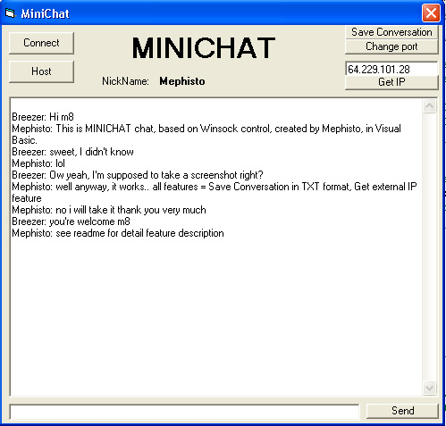



## \[Winsock MiniChat, Get IP, Save Conversation etc\]

### Description

This code is heavily commented example of how to create a simple chat using winsock component. It has also some more features like Save Conversation, Get External IP, Nickname.

NO API's, NO Modules, NO 1000 forms, just plain simple working code
 
### More Info
 

             |
---                |---
**Submitted On**   |2003-12-04 19:44:02
**By**             |[Mephisto](https://github.com/Planet-Source-Code/PSCIndex/blob/master/ByAuthor/mephisto.md)
**Level**          |Intermediate
**User Rating**    |5.0 (10 globes from 2 users)
**Compatibility**  |VB 6\.0
**Category**       |[Internet/ HTML](https://github.com/Planet-Source-Code/PSCIndex/blob/master/ByCategory/internet-html__1-34.md)
**World**          |[Visual Basic](https://github.com/Planet-Source-Code/PSCIndex/blob/master/ByWorld/visual-basic.md)
**Archive File**   |[\[Winsock\_M1680331242003\.zip](https://github.com/Planet-Source-Code/mephisto-winsock-minichat-get-ip-save-conversation-etc__1-50319/archive/master.zip)

